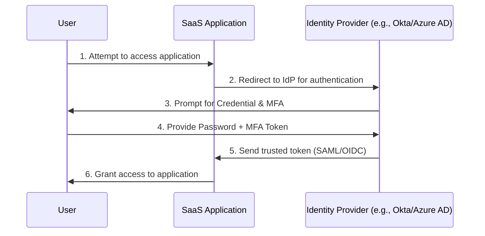
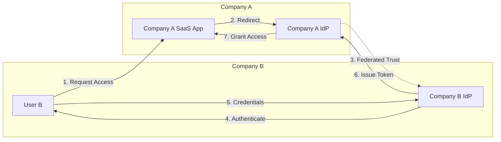
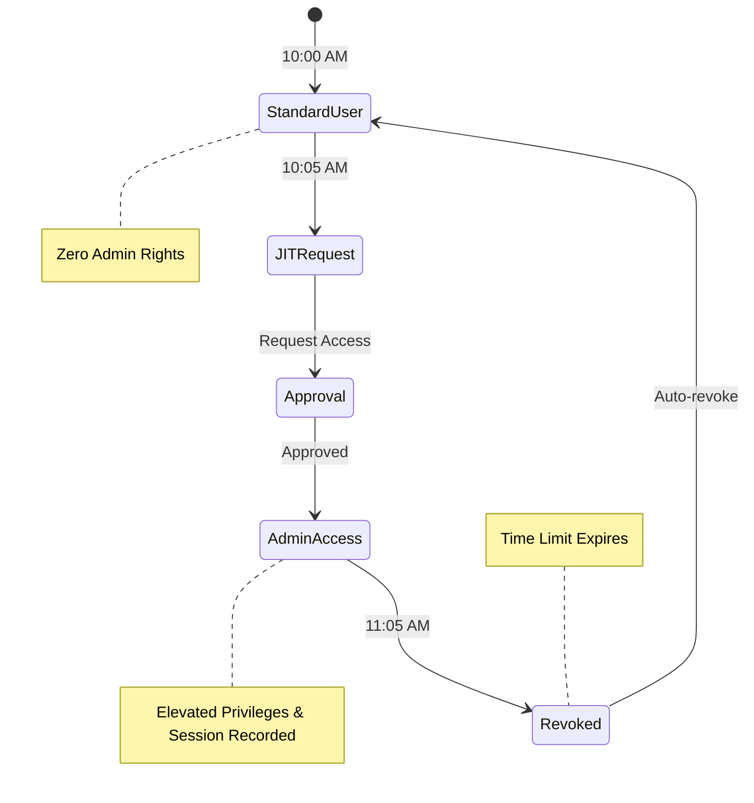

# Section 05: Identity and Access Management (IAM) Deep Dive

In the modern enterprise, the corporate perimeter has dissolved. Employees work from coffee shops on personal devices, accessing data hosted in third-party SaaS clouds. Because the traditional network perimeter is gone, **Identity is the new perimeter.**

Identity and Access Management (IAM) is the framework of policies and technologies to ensure that the right users (identities) have the appropriate access to technology resources.

---

## 1. Multi-Factor Authentication (MFA) and Single Sign-On (SSO)

Passwords alone are categorically insufficient. They are easily guessed, reused across multiple sites, and constantly exposed in data breaches. 

### Multi-Factor Authentication (MFA)
Authentication is typically broken down into three factors:
1. **Something you know**: A password, a PIN.
2. **Something you have**: A smartphone, a hardware security key (YubiKey), a smartcard.
3. **Something you are**: Biometrics (fingerprint, FaceID, retina scan).

*MFA requires the use of at least two different factors to successfully log in.* 

**Important Note on Phishing-Resistant MFA:**
Not all MFA is created equal. SMS-based MFA (receiving a code via text) is highly vulnerable to SIM-swapping and adversary-in-the-middle (AiTM) phishing attacks. Phishing-Resistant MFA, such as FIDO2 hardware tokens (YubiKeys) or Windows Hello for Business, must be implemented for robust defense.

### Single Sign-On (SSO)
Managing 50 different passwords for 50 different work applications leads to password fatigue and poor security hygiene. SSO solves this.
- SSO allows a user to log in exactly *one* time using a strong primary credential (backed by MFA) to an Identity Provider (IdP) like Okta or Azure AD.
- Once authenticated, the IdP generates a trusted token (via OIDC or SAML) and securely passes it to the various SaaS applications, logging the user in automatically without them ever typing a password into the target app.

---

## 2. Federated Identity Management

**Federation** takes SSO a step further. While SSO typically works within a single organization's domain, Federation allows SSO to work *across* different, unaffiliated organizations.

-   **Use Case**: Suppose Company A completely acquires Company B. Company A uses Azure AD, and Company B uses Okta. Instead of migrating everyone immediately, the two companies can "federate" their Identity Providers. 
-   **The Process**: Through cryptographic trust, Company A’s applications are configured to trust tokens issued by Company B’s IdP. A user from Company B can access Company A’s resources using their own standard login credentials.
-   Common protocols enabling federation include **SAML (Security Assertion Markup Language)**, **OAuth 2.0**, and **OpenID Connect (OIDC)**.

---

## 3. Privileged Access Management (PAM)

Not all identities are equal. While a standard user compromising their account might expose a few documents, a Domain Administrator compromising their account could result in the deployment of company-wide ransomware. 

**Privileged Access Management (PAM)** refers to the specialized tools and processes used to secure, control, and monitor access to an organization’s most critical assets and accounts.

### Key Features of a PAM Solution (e.g., CyberArk, Delinea):
-   **Credential Vaulting**: Admins no longer know the passwords to the servers they manage. Passwords are super complex, auto-rotated daily, and locked in an encrypted vault.
-   **Just-In-Time (JIT) Access**: "Standing privileges" are eliminated. Even if someone is an IT Admin, they have exactly zero admin rights at 10:00 AM. At 10:05 AM, they request JIT access to fix a server, it is approved, and at 11:05 AM, the access is automatically revoked.
-   **Session Recording**: High-risk privileged sessions are video-recorded and keystroke-logged for auditing and forensics. If a breach occurs, investigators can play back exactly what the attacker typed.

---

## 4. Additional Resources

For deeper exploration into identity security, authentication mechanisms, and associated vulnerabilities:
- **[Hacker Repo (hackerrepo.org)](https://hackerrepo.org)**: Explore the `cloud-resources` directory for guides on securing major Identity Providers (like Azure AD and AWS IAM) and the `post-exploitation` directory to understand how attackers abuse misconfigured identities.
- **[Hacker Training (hackertraining.org)](https://hackertraining.org)**: Find hands-on courses focusing on the deployment and defense of core infrastructure and identity platforms.
