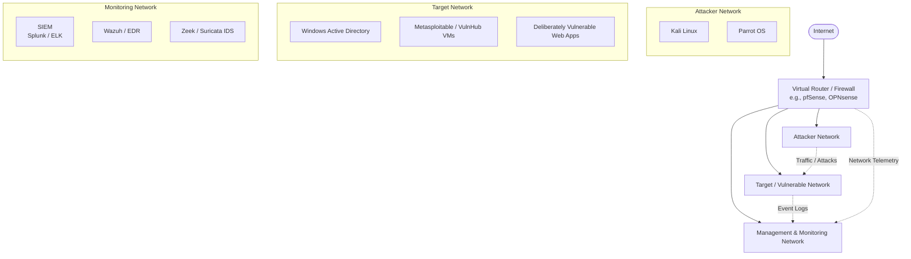

# Building Your Cyber Lab

Creating a personal cybersecurity lab is essential for hands-on practice, testing exploits, and understanding network defense mechanisms in a safe, isolated environment.

## Typical Cyber Lab Architecture

A standard cybersecurity lab often involves separating networks into different planes, simulating a real-world enterprise environment. Here is a high-level overview of a typical lab setup:

### Components of the Lab:
- **Router / Firewall**: Acts as the gateway, isolating the lab networks from your home network and routing traffic between the internal lab subnets.
- **Attacker Network**: Contains offensive security distributions used to launch attacks, run scans, and test vulnerabilities.
- **Target Network**: Hosts vulnerable virtual machines and services (like web applications or Active Directory) to practice exploitation and defense.
- **Monitoring Network**: Collects basic logs, network traffic, and security events from the target and routing infrastructure for analysis, incident response, and threat hunting.

## Resources to Build Your Own Lab

The following are some amazing resources to guide you through building your own cyber lab:
- [The Art of Hacking GitHub Repository Section](https://github.com/The-Art-of-Hacking/h4cker/tree/master/build-your-own-lab)
- [Building the Ultimate Cybersecurity Lab and Cyber Range](https://learning.oreilly.com/course/building-the-ultimate/9780138319090/) (video) Available on O'Reilly!